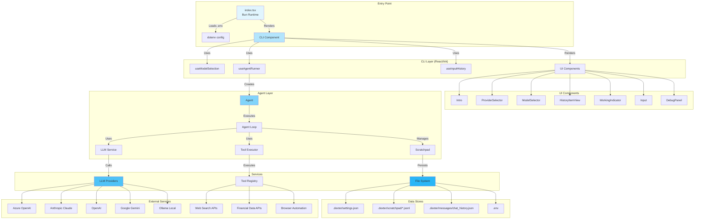
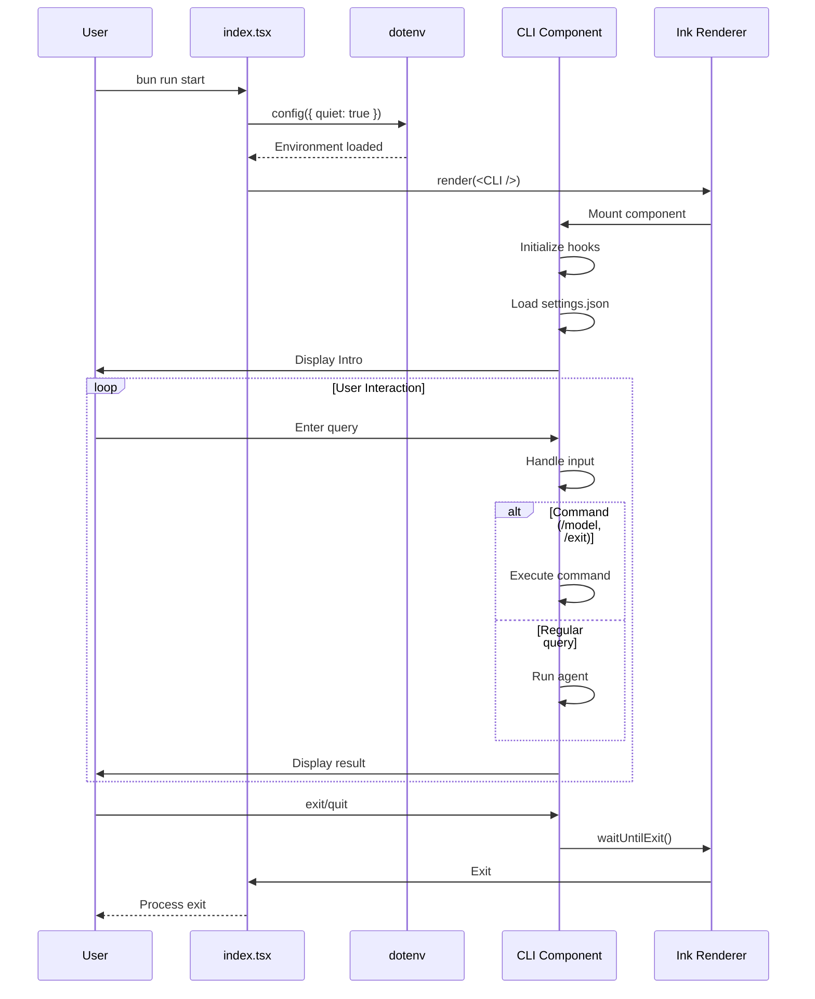
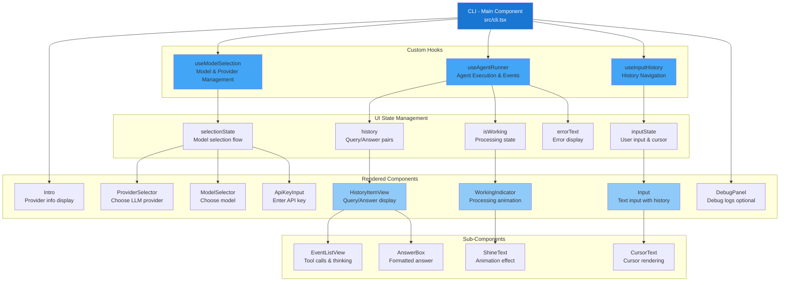
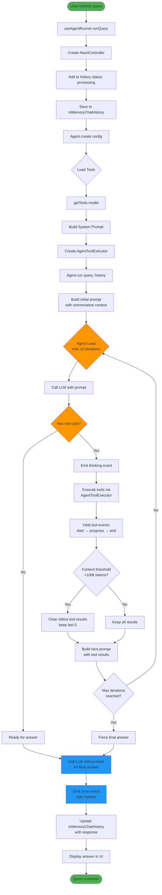
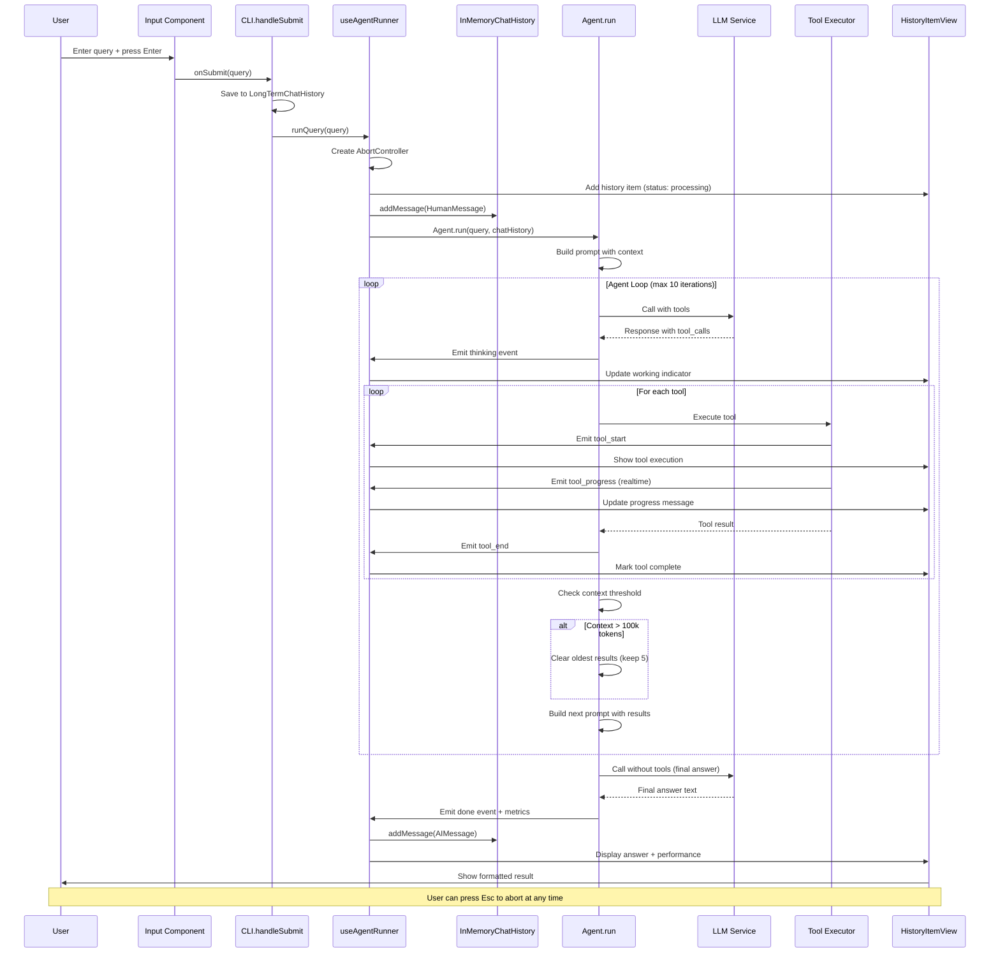
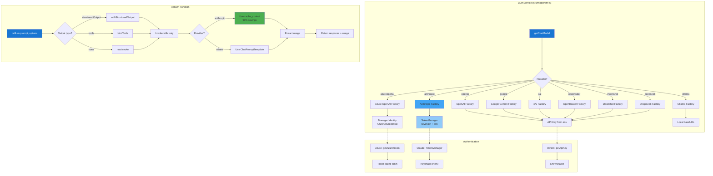
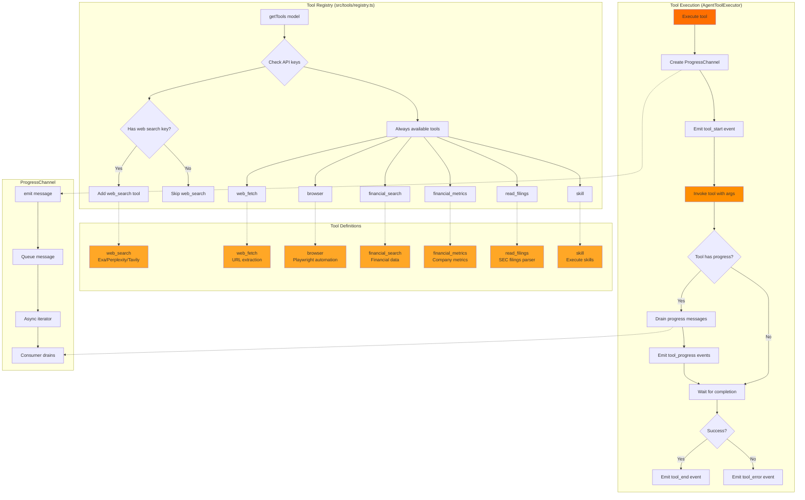
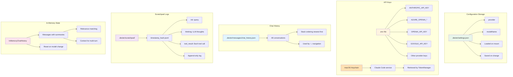
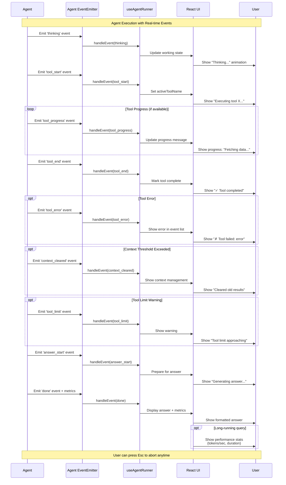

# Dexter CLI System Architecture

## Table of Contents
1. [High-Level Architecture](#high-level-architecture)
2. [Entry Point & CLI Flow](#entry-point--cli-flow)
3. [Component Hierarchy](#component-hierarchy)
4. [Agent Execution Flow](#agent-execution-flow)
5. [State Management](#state-management)
6. [Data Flow](#data-flow)
7. [LLM Integration](#llm-integration)
8. [Tool System](#tool-system)
9. [Storage & Persistence](#storage--persistence)
10. [Event System](#event-system)

---
Key Differences
Feature	Web App	Evals App
UI	React (Browser)	Ink (Terminal)
Server	HTTP Gateway (port 3000)	None
Agent Access	Via agent-runner.ts	Direct Agent.create()
Concurrent Users	✅ Multiple sessions	❌ Single run
Purpose	Interactive chat	Testing & evaluation
Streaming	SSE over HTTP	AsyncGenerator in-process
Logging	Console logs	LangSmith + terminal UI

1. Web App (Uses HTTP Gateway)


User Browser (localhost:5173)
         ↓
   React Frontend
         ↓ HTTP/SSE
   HTTP Gateway (localhost:3000) ← [http-gateway.ts]
         ↓
   Agent Runner → Agent.create()
         ↓
   Tools (finance, search, etc.)

2. Evals App (Terminal-only, No HTTP)


Terminal
    ↓
Ink UI (EvalApp.tsx) ← Terminal React components
    ↓
createEvaluationRunner() ← [run.ts]
    ↓
Agent.create() ← Direct agent invocation
    ↓
Tools (finance, search, etc.)
    ↓
LangSmith ← Logs results for tracking


## High-Level Architecture



---

## Entry Point & CLI Flow



---

## Component Hierarchy



---

## Agent Execution Flow



---

## State Management

```mermaid
graph LR
    subgraph "useModelSelection Hook"
        A1[selectionState] --> A2[provider]
        A1 --> A3[modelName]
        A1 --> A4[apiKey]
        A1 --> A5[stage]
        A2 --> A6[Persist to<br/>.dexter/settings.json]
        A3 --> A6
    end

    subgraph "useAgentRunner Hook"
        B1[history] --> B2[HistoryItem[]]
        B2 --> B3[query]
        B2 --> B4[events]
        B2 --> B5[answer]
        B2 --> B6[status]
        B2 --> B7[metrics]
    end

    subgraph "useInputHistory Hook"
        C1[messages] --> C2[Load from<br/>chat_history.json]
        C1 --> C3[Navigate with<br/>↑↓ arrows]
        C1 --> C4[Persist on<br/>new message]
    end

    subgraph "InMemoryChatHistory (Ref)"
        D1[chatHistory] --> D2[stores messages<br/>for context]
        D2 --> D3[LLM summarizes<br/>for relevance]
        D3 --> D4[Selects relevant<br/>past messages]
    end

    subgraph "Refs (Non-rendered State)"
        E1[abortControllerRef] --> E2[Cancel execution]
        E3[historyNavigationRef] --> E4[Track cursor<br/>position]
    end

    A6 -.->|Read on mount| A1
    C2 -.->|Read on mount| C1
    C4 -.->|Write on submit| C1

    style A1 fill:#e3f2fd
    style B1 fill:#e1f5fe
    style C1 fill:#e0f7fa
    style D1 fill:#e0f2f1
    style E1 fill:#f3e5f5
```

---

## Data Flow: User Input → Agent → Output



---

## LLM Integration



---

## Tool System



---

## Storage & Persistence



---

## Event System



### Event Types

```typescript
type AgentEvent =
  | ThinkingEvent         // LLM reasoning text
  | ToolStartEvent        // Tool execution initiated
  | ToolProgressEvent     // Real-time progress from tool
  | ToolEndEvent          // Tool completed successfully
  | ToolErrorEvent        // Tool failed with error
  | ToolLimitEvent        // Tool call limit warning
  | ContextClearedEvent   // Old context removed
  | AnswerStartEvent      // Final answer generation started
  | DoneEvent             // Complete with answer & metrics
```

---

## Keyboard Shortcuts & Commands

| Input | Action |
|-------|--------|
| `exit`, `quit` | Exit application |
| `/model` | Start model selection flow |
| `Esc` | Cancel current action/execution |
| `Ctrl+C` | Cancel or exit |
| `↑` / `↓` | Navigate input history |
| `Shift+Enter` | Multi-line input |
| `Ctrl+A` | Move to start of line |
| `Ctrl+E` | Move to end of line |
| `Alt+←` / `Alt+→` | Word navigation |

---

## Performance Optimizations

### 1. **Anthropic Prompt Caching**
- System prompt marked with `cache_control: { type: 'ephemeral' }`
- 90% cost reduction on subsequent calls
- Implemented in `buildAnthropicMessages()`

### 2. **Azure Token Caching**
- Tokens cached for 5 minutes
- Reduces auth overhead
- Automatic refresh before expiry

### 3. **Context Management**
- Threshold: 100k tokens
- Keeps last 5 tool results
- Clears oldest results when exceeded
- Full context for final answer

### 4. **Tool Result Summarization**
- LLM summarizes large tool outputs
- Reduces context size
- Preserves key information

### 5. **InMemoryChatHistory Relevance**
- Caches relevance scores
- Only selects relevant past messages
- Reduces prompt size for multi-turn

---

## Error Handling & Safety

### 1. **Graceful Cancellation**
```typescript
AbortController → agent.run(signal)
                → tool.invoke(signal)
                → Mark as 'interrupted'
```

### 2. **Retry Logic**
- Exponential backoff
- Max 3 attempts per LLM call
- Logs each failure attempt

### 3. **Soft Limits**
- Tool call warnings (not blocks)
- Query similarity detection
- Informs LLM via prompt

### 4. **Error Display**
- Tool errors shown in event list
- Agent continues execution
- Final error state if critical

---

## Architecture Highlights

### ✅ **Strengths**

1. **Real-time Event Streaming** - Async generator pattern for instant UI updates
2. **Modular Hook Design** - Separation of concerns (model, agent, history)
3. **Multi-provider Support** - Easy to add new LLM providers
4. **Graceful Degradation** - Continues on tool errors, soft limits
5. **Context Management** - Intelligent clearing for long conversations
6. **Comprehensive Persistence** - Settings, history, scratchpad all saved
7. **Developer Experience** - Ink/React for terminal UI, TypeScript
8. **Cancellation Support** - User can abort at any time
9. **Progress Feedback** - Real-time tool progress via ProgressChannel
10. **Flexible Tool System** - Easy to add new tools

### 🔄 **Key Patterns**

- **React Hooks** for state management
- **Async Generators** for event streaming
- **AbortController** for cancellation
- **Ink Components** for terminal rendering
- **JSONL Logs** for debugging
- **TokenManager** for credential management
- **ProgressChannel** for real-time updates

---

## File Structure Summary

```
src/
├── index.tsx                    # Entry point (Bun runtime)
├── cli.tsx                      # Main CLI component (React/Ink)
│
├── agent/
│   ├── agent.ts                 # Agent class with execution loop
│   ├── prompts.ts               # System prompts
│   ├── scratchpad.ts            # JSONL logging & context management
│   ├── token-counter.ts         # Token usage tracking
│   └── types.ts                 # Agent event types
│
├── model/
│   ├── llm.ts                   # LLM integration (getChatModel, callLlm)
│   ├── token-manager.ts         # Keychain + env credential management
│   └── azure-openai-models.ts   # Azure constants
│
├── tools/
│   ├── registry.ts              # Tool registration (getTools)
│   ├── web-search.ts            # Search tools (Exa/Perplexity/Tavily)
│   ├── web-fetch.ts             # URL fetching
│   ├── browser.ts               # Playwright automation
│   ├── financial-search.ts      # Financial data
│   └── skill.ts                 # Skill execution
│
├── ui/
│   ├── model-selector.tsx       # Provider/model selection
│   ├── history-item-view.tsx    # Query/answer display
│   ├── answer-box.tsx           # Formatted answer
│   ├── agent-event-view.tsx     # Tool/thinking events
│   ├── working-indicator.tsx    # Processing animation
│   └── input.tsx                # Text input with history
│
├── hooks/
│   ├── use-model-selection.ts   # Model selection state
│   ├── use-agent-runner.ts      # Agent execution state
│   └── use-input-history.ts     # History navigation
│
├── utils/
│   ├── in-memory-chat-history.ts      # Conversation context
│   ├── long-term-chat-history.ts      # Persistent history
│   ├── progress-channel.ts            # Real-time progress
│   ├── settings.ts                    # Settings persistence
│   └── logger.ts                      # Logging
│
└── providers.ts                 # Provider registry

.dexter/
├── settings.json                # Provider & model config
├── scratchpad/
│   └── timestamp_hash.jsonl     # Per-query logs
└── messages/
    └── chat_history.json        # All conversations
```

---

## Technology Stack

| Layer | Technology |
|-------|-----------|
| **Runtime** | Bun |
| **Language** | TypeScript |
| **UI Framework** | React + Ink (terminal rendering) |
| **LLM Integration** | LangChain |
| **State Management** | React Hooks + Refs |
| **Storage** | JSON/JSONL files |
| **Authentication** | Azure Identity, TokenManager |
| **Web Automation** | Playwright |
| **Async Patterns** | Async generators, EventEmitter |

---

## Extending the Architecture

### Adding a New Tool

1. Create tool in `src/tools/`
2. Register in `src/tools/registry.ts`
3. Optionally implement ProgressChannel for real-time updates

### Adding a New LLM Provider

1. Add factory to `MODEL_FACTORIES` in `src/model/llm.ts`
2. Register provider in `src/providers.ts`
3. Update UI options in `PROVIDERS` array

### Adding New UI Component

1. Create component in `src/ui/`
2. Integrate in `src/cli.tsx`
3. Use Ink's Box/Text components for layout

---

**Last Updated:** 2026-02-14
**Architecture Version:** 2026.2.14
